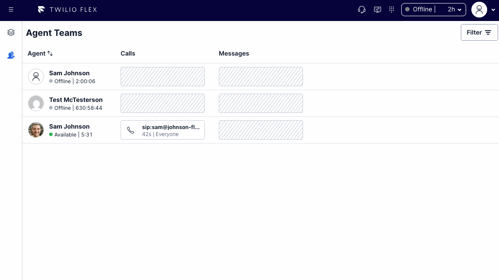

# Agent Teams Views Example Flex Plugin

In Flex, workers with only the agent role cannot access the Teams view. Hacking the Teams view in results in some weird/crashy behavior, so an alternative approach is needed. This plugin adds a new view to the side nav for agent users, "Agent Teams."

"Agent Teams" uses the Flex-provided components for the teams data table and the teams filter panel. Custom logic is used to load worker and reservation data from the Insights Sync client and to form queries based on selected filters. This allows existing function-based Teams view filters to be used in the plugin by passing them to the `filters` prop of `AgentTeamsViewComponent`.

## Limitations

- The "Agent Teams" view may not automatically receive all new features added to the out-of-box "Teams" view.

## Disclaimer

**This software is to be considered "sample code", a Type B Deliverable, and is delivered "as-is" to the user. Twilio bears no responsibility to support the use or implementation of this software.**
